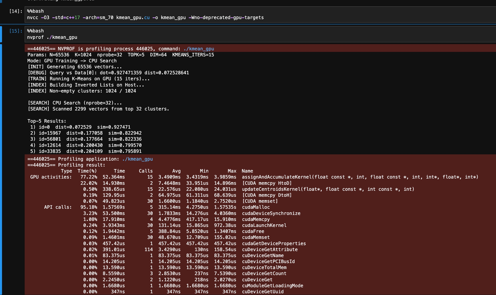
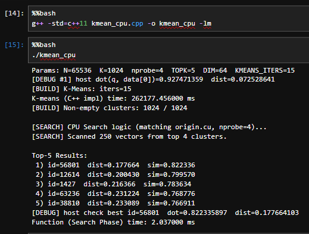
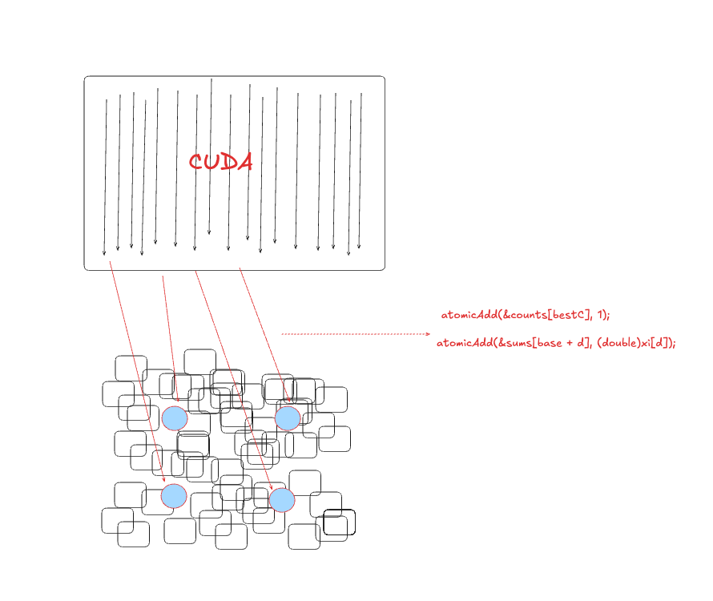
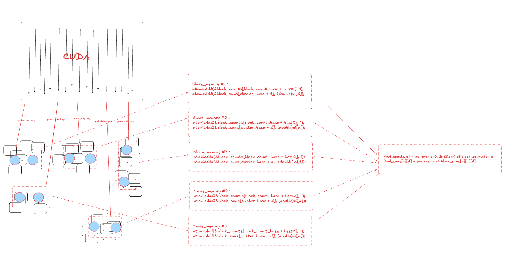
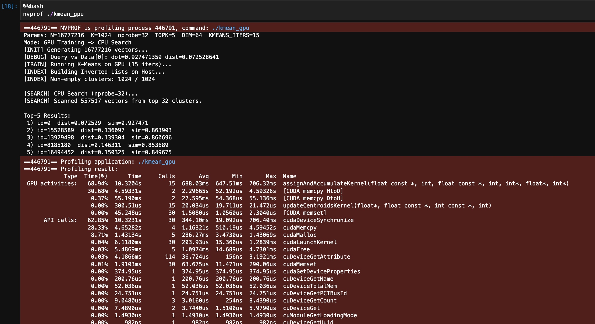
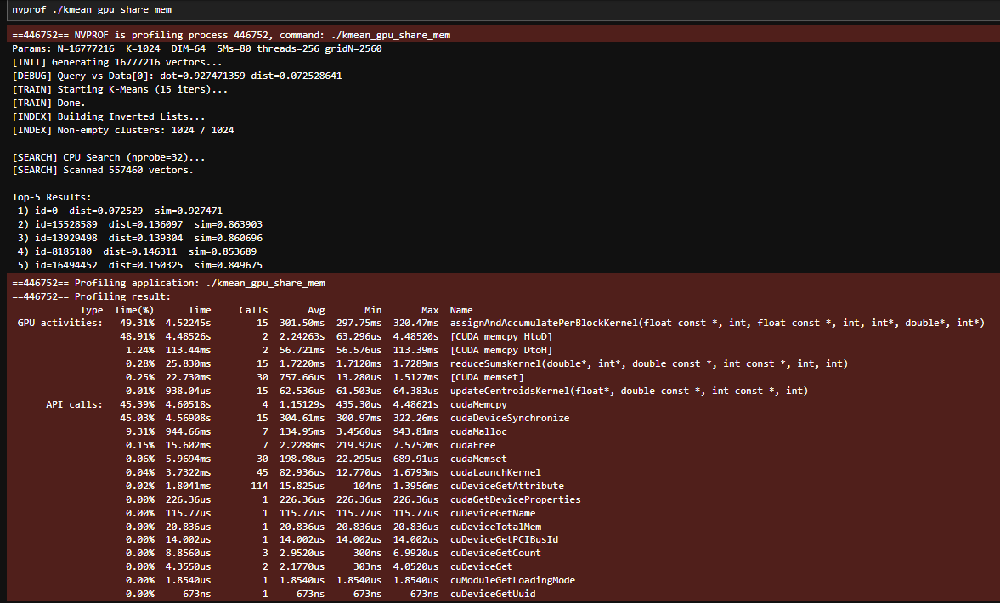

# 🚀 CUDA-Accelerated K-Means : Foundation for Scalable ANN Search

This project focuses on delivering a highly optimized, GPU-accelerated implementation of the K-Means Clustering algorithm. This acceleration is critical because K-Means serves as the foundational infrastructure for nearly all scalable **Approximate Nearest Neighbor (ANN) search** systems,  particularly those that use an IVF (Inverted File) index.

The core objective is to minimize the time required to partition massive, high-dimensional vector datasets, thereby enabling rapid construction of the search structure.

---
## What is K-Means and what are its applications?

K-Means is an algorithm used to partition $N$ data points into $K$ pre-defined, non-overlapping clusters (or groups).

1. Goal: To minimize the Within-Cluster Sum of the total distance between each data point and the center (centroid) of the cluster it belongs to.
2. Result: Data points within the same cluster are highly similar, while points in different clusters are dissimilar.
3. Inputs: The dataset (a collection of high-dimensional vectors), and the value of $K$ (the desired number of clusters).

It is one of the most fundamental and widely used Unsupervised Machine Learning algorithms. It is essential for partitioning large, high-dimensional datasets into distinct, coherent groups. In modern AI pipelines, this acts as the high-performance 'Retrieval Engine' for Vector Embeddings generated by Deep Learning models (such as BERT for text or ResNet for images). It is the core technology behind semantic search, recommendation systems, and the long-term memory (RAG) used by Large Language Models (LLMs).


## How is K-means trained in C++ code?
```c++
// ---------------- Device: Distance Kernels (Simulated for Training) ----------------

/**
 * E-Step: Assign data to nearest centroid & Accumulate stats
 * * This function simulates the "Expectation" step of K-Means.
 * It iterates through every data point, finds the closest centroid (using Cosine Distance),
 * assigns the point to that cluster, and accumulates the vector sums and counts
 * needed for the next update step.
 */
void assignAndAccumulateKernel(const float* data,
                                  int N_points,
                                  const float* centroids,
                                  int K_clusters,
                                  int* assign,
                                  float* sums,
                                  int* counts) {
    
    // Loop 1: Iterate through every single data point (0 to N-1)
    for (int i = 0; i < N_points; i++) {
        
        // Get pointer to the current data vector (Dimension = DIM)
        const float* xi = data + (size_t)i * DIM;

        int bestC = 0;          // Store the index of the nearest cluster
        float bestD = 1e30f;    // Initialize minimum distance to a large value

        // Loop 2: Compare current point 'xi' against all K centroids
        for (int c = 0; c < K_clusters; ++c) {
            const float* ctr = centroids + (size_t)c * DIM;
            
            // Calculate Dot Product (Inner Product)
            float dot = 0.f;
            for (int d = 0; d < DIM; ++d) dot += xi[d] * ctr[d];

            // Convert Cosine Similarity to Cosine Distance
            // Distance = 1.0 - Similarity
            float dist = 1.f - dot;

            // Keep track of the nearest centroid found so far
            if (dist < bestD) {
                bestD = dist;
                bestC = c;
            }
        }

        // 1. Record the assignment: Point 'i' belongs to Cluster 'bestC'
        assign[i] = bestC;

        // 2. Accumulate count: Increment the member count for this cluster
        counts[bestC]++;

        // 3. Accumulate sums: Add this vector's coordinates to the cluster's total
        // This prepares for the average calculation in the next step.
        size_t base = (size_t)bestC * DIM;
        for (int d = 0; d < DIM; ++d) {
            sums[base + d] += xi[d];
        }
    }
}

/**
 * M-Step: Update Centroids
 * * This function simulates the "Maximization" step of K-Means.
 * It calculates the new position of each centroid by averaging the vectors 
 * assigned to it, and then normalizes the result to ensure it stays on the unit hypersphere.
 */
void updateCentroidsKernel(float* centroids,
                                  const float* sums,
                                  const int* counts,
                                  int K_clusters) {
    
    // Loop 1: Iterate through every cluster (0 to K-1)
    for (int c = 0; c < K_clusters; c++) {
        
        int cnt = counts[c];    // Number of points in this cluster
        
        // Pointers to the current centroid and its accumulated sum
        float* ctr = centroids + (size_t)c * DIM;
        const float* sumc = sums + (size_t)c * DIM;
    
        // Only update if the cluster is not empty
        if (cnt > 0) {
            double norm2 = 0.0;

            // Loop 2: Calculate the Mean (Average) Vector
            for (int d = 0; d < DIM; ++d) {
                // New Coordinate = Total Sum / Count
                float v = sumc[d] / (float)cnt;
                ctr[d] = v;

                // Accumulate squared magnitude for normalization later
                norm2 += (double)v * (double)v;
            }

            // Calculate the L2 Norm (Euclidean length)
            // Added 1e-12 to prevent division by zero
            float n = float(std::sqrt(norm2) + 1e-12);

            // Loop 3: Normalization
            // Since we use Cosine Distance, centroids must be normalized 
            // (length = 1.0) to lie on the unit sphere.
            for (int d = 0; d < DIM; ++d) {
                ctr[d] /= n;
            }
        }
    }
}
```
---

## An example case to illustrate K-means


Imagine you are a logistics giant (like Amazon) operating in a massive city with 16 million customers ($N$). Your goal is to build 1,024 delivery stations ($K$) to ensure every customer gets the fastest service possible.

**Phase 1: K-Means Training (Building the Network)**

 *  Day 1: Blind Selection (Initialization) 
 
    You don't know where the customers live yet, so you randomly drop 1,024 temporary kiosks on the map. Some land in lakes; some land in empty fields. It is inefficient.

 *  The "Assignment" Morning (Assignment-Step) 
 
    Every single one of the 16 million customers checks their GPS to find which of the 1,024 kiosks is closest to their home. They register themselves: "I belong to Station #5."(In Code: The GPU calculates 16M $\times$ 2048 distances in parallel.)

 * The "Relocation" Evening (Relocation-Step)
 
    The manager of Station #5 looks at his list and realizes: "All my customers live 3 miles north, but I'm stuck here in the south."He calculates the exact geographic center (average coordinate) of all his registered customers and moves the station there overnight to be closer to everyone.

 * Iteration (Convergence)
    
    Because the stations moved, some customers realize a different station is now closer. They switch registrations. The stations move again to adjust. After 15 days (iterations), the stations stop moving. They are now perfectly positioned in the center of the 1,024 most dense population hubs.

**Phase 2: IVF Search (Delivering the Package)**

Now a new order comes in (The Query Vector $q$). 

We need to find which existing customer is most similar to this new order (Nearest Neighbor).

* The Old Way (Brute Force)

    You send a driver to knock on all 16 million doors in the city to see who placed the order. Result: It takes 4 seconds. The pizza is cold. The customer is angry.

* The New Way (IVF Search)

    Step A: Coarse Search (Find the District) Instead of looking at houses, you only look at the 1,024 Delivery Stations. You calculate: "Which station is closest to this new order address?" You find that Station #5 (and maybe its neighbors, Station #6 and #7) is the closest.
    
    Step B: Fine Search (Last Mile) You open the list for Station #5. It only serves 15,000 customers. You only check these specific houses. Result: You found the target in 15 milliseconds. The pizza is still hot.


### Why K-Means training could be accelerated by using CUDA?
The core task—calculating distances for millions of vectors—is "embarrassingly parallel." Since every vector can be processed independently, we can launch millions of threads to instantly saturate the GPU's thousands of cores, achieving a speedup that CPUs simply cannot match.

---


# Main focus: Parallelism & Efficiency

The key shows in maximizing parallelism and efficiency across the two main K-Means steps:

|name|Component | Description | **Acceleration & Optimization** | function 
| :---|:--- | :--- | :--- | :---|
|**E-step**| **Massive Parallel steps (Assignment)** | Utilizing the GPU's massive parallelism, each of the $N$ data points is assigned a dedicated thread to calculate its distance to all $K$ centroids. It also includes the accumulation of vector sums and counts using optimized methods. | Compute-Bound Optimization: This transforms the heavy $O(N \times K)$ matrix operation into a massively parallel workload. It also features Per-Block Privatization to eliminate global atomicAdd contention. | **assignAndAccumulateKernel**|
|**M-step**| **Final Centroid Update (Mean & Normalize）** | Calculates Centroid Mean and Normalization: It computes the average vector for each cluster by dividing the total accumulated vector sums (received from the E-step) by the counts, then normalizes the resulting vector. |The M-step focuses on memory efficiency and arithmetic intensity. Coalesced memory accesses are used to efficiently read accumulated partial sums and counts from global memory. Each centroid update is parallelized across GPU threads, while SIMD-style normalization minimizes branching and improves warp execution efficiency. | **updateCentroidsKernel**|


```c++
// E-step: Assign data to nearest centroid (E-Step: Data Assignment)
__global__ void assignAndAccumulateKernel(const float* data,      // [Input] Dataset (N * DIM)
                                          int N,                 // Total number of data points
                                          const float* centroids, // [Input] Centroids (K * DIM)
                                          int K,                 // Total number of clusters K
                                          int* assign,            // [Output] Assignment results (N elements, storing 0..K-1)
                                          double* sums,           // [Output] Accumulator: Centroid vector sums (K * DIM, using double precision)
                                          int* counts)           // [Output] Accumulator: Centroid counts (K elements)
{
    // Each thread processes one or more data points
    for (int i = blockIdx.x * blockDim.x + threadIdx.x;
         i < N;
         i += gridDim.x * blockDim.x) {

        // Get the starting pointer for the current data point xi
        const float* xi = data + (size_t)i * DIM;

        int bestC = 0;
        // Initialize the minimum distance with a sufficiently large number (e.g., FLT_MAX)
        float bestD = 1e30f; 

        // Iterate through all K centroids to find the closest one
        for (int c = 0; c < K; ++c) {
            // Get the starting pointer for the current centroid ctr
            const float* ctr = centroids + (size_t)c * DIM;
            
            // Use double precision for dot product accumulation to improve numerical stability
            double dot_double = 0.0; 
            for (int d = 0; d < DIM; ++d) {
                // Promote float values to double for multiplication and addition
                dot_double += (double)xi[d] * (double)ctr[d]; 
            }
            float dot = (float)dot_double; // Convert the final result back to float for distance comparison
            
            // Calculate cosine distance: 1.0 - similarity (similarity is the dot product)
            float dist = 1.f - dot;
            
            // Update the nearest centroid
            if (dist < bestD) {
                bestD = dist;
                bestC = c;
            }
        }
        // Record the assignment result for data point i
        assign[i] = bestC;
        // Atomic add to accumulators (Atomic operations resolve concurrent write conflicts)
        // Accumulate count
        atomicAdd(&counts[bestC], 1);
        
        // Accumulate vector sum
        size_t base = (size_t)bestC * DIM;
        for (int d = 0; d < DIM; ++d) {
            // Convert the float xi[d] to double before atomically adding to the double sums array
            atomicAdd(&sums[base + d], (double)xi[d]); 
        }
    }
}

// -----------------------------------------------------------------------------

// M-step: Update centroids (M-Step: Centroid Update)
__global__ void updateCentroidsKernel(float* centroids,      // [Output] Centroids (updated values)
                                      const double* sums,    // [Input] Accumulated vector sums (double precision)
                                      const int* counts,     // [Input] Accumulated counts
                                      int K) {
    // Each thread processes one centroid c
    int c = blockIdx.x * blockDim.x + threadIdx.x;
    if (c >= K) return;

    int cnt = counts[c];
    float* ctr = centroids + (size_t)c * DIM;      // Pointer to the centroid to be updated
    const double* sumc = sums + (size_t)c * DIM;   // Pointer to the vector sum for centroid c

    if (cnt > 0) { // Only update centroids that were assigned data points
        double norm2 = 0.0;
        for (int d = 0; d < DIM; ++d) {
            // FIX: Use double for precise average calculation (sum / count)
            double v_double = sumc[d] / (double)cnt;
            float v = (float)v_double; // Convert result back to float for storage
            
            ctr[d] = v;
            
            // Use double precision to accumulate the squared norm, preparing for unit normalization
            norm2 += v_double * v_double; 
        }
        
        // Centroid Normalization (Unit Length)
        // Calculate the L2 norm (magnitude)
        float n = float(std::sqrt(norm2) + 1e-12); 
        
        // Normalize the centroid vector onto the unit sphere
        for (int d = 0; d < DIM; ++d) {
            ctr[d] /= n;
        }
    }
}

```


### Parameters

These define the scale and quality of the partitioning infrastructure:

| Parameter | Macro | Description | Default Value |
| :--- | :--- | :--- | :--- |
| **Total Data Points** | `N` | The size of the vector dataset to be partitioned. | $2^{24} \approx 16$ Million |
| **Number of Clusters** | `K` | The final number of partitions (centroids) generated for the ANN search structure. | 1024 |
| **K-Means Iterations** | `KMEANS_ITERS` | The number of training cycles required to stabilize the $K$ partitions. | 15 |

---

## Verification: Validating Acceleration on ANN Search

To validate the efficiency and quality of the accelerated K-Means output, we perform a subsequent ANN Search Verification step.

After the process of training, the code will generate $K$ highly optimized centroids and assign $N$ data points to one of these $K$ partitions each. These will be converted into $K$ number of IVFs (Inverted File Index); This output is the last critical stage for building the ANN search structure.

```c++

static void buildInvertedLists(
    const std::vector<int>& assign,
    int N, int K,
    std::vector<std::vector<int>>& lists
) {
    lists.assign(K, {});
    for (int i = 0; i < N; ++i) {
        int c = assign[i];
        if (c >= 0 && c < K) {
            lists[c].push_back(i);
        }
    }
}
```

### Target Output

This step is to accurately identify the $TOPK$ nearest neighbors to a query vector $Q$ among the entire massive dataset of $N$ vectors.

Based on the results of this step, we can compare how much speedup we achieved by using **CUDA** acceleration as opposed to the sequential process via **C++**

* This is accomplished by leveraging the trained partitions: first, the query $Q$ is compared against the $K$ centroids for a Coarse Search to select the closest $N_{PROBE}$ partitions; second, all vectors from these selected partitions are collected into a Candidate Set; and finally, an optimized Top-K Final Search is executed solely on this small candidate set to pinpoint and return the $TOPK$ results. 

---

## Environment and Execution

* **Jupyter Server:** CUDA Version: 12.9   
* **Software:** NVIDIA CUDA Toolkit (v11.x+), `nvcc` compiler.
* **gcc:** Version c++ 17

### Compilation and Running

```bash
# Compile: Focused on K-Means and the ANN infrastructure build
nvcc -O3 -std=c++17 -arch=sm_70 origin.cu -o origin -Wno-deprecated-gpu-targets

# Run: Executes the accelerated clustering process and the ANN verification search
./ann_kmeans_accelerated
```

---


## Performance execution

### CUDA version



**assignAndAccumulateKernel** (E-step, main workload)

Total Time: ~52.36 ms \
Calls: 15 (same as KMEANS_ITERS=15) \
Average per iteration: ~3.49 ms

**updateCentroidsKernel** (M-step, centroid update)

Total Time: ~0.34 ms \
Average per iteration: ~0.02 ms \
K-Means GPU compute (E-step + M-step)
~52.7 ms

### C++ version




### Speedup Comparison

| n            |     C++ (ms) |   CUDA (ms) | SpeedUp ( sequential vs parallel ) |
| ------------ | ---------: | ---------: | ---------: | 
| 2^16 (65536) | 262177.456000 ms | 52.7 ms | 4974x |

---

## We already achieved a large time speedup, but can it be faster?


Yes,The first version of **assignAndAccumulateKernel** just simply implemented algorithm in primary performance in the K-Means E-Step, when accumulating centroid sums and counts, relay in the use of global `atomicAdd` operations.This technique involves allocating a private accumulation buffer in global memory for each thread block.

- The initial version of kmean e-step :



 This is necessary because millions of threads  must update a small number of shared locations ($K$ centroids). This high contention forces the GPU's parallel execution into a severe serialization queue, significantly undermining throughput. The optimal solution is to implement Per-Block or sharding computation to reduce data racing. 

Threads within a block perform their atomic updates exclusively to this private buffer.


And We achieved Much faster least 3x speedup then initial Version Since different blocks write to entirely separate memory regions, the debilitating cross-block contention is eliminated.Second, much faster reduction step is then used to merge these $B$ block-local sums into the final $K$ centroid values, unlocking the GPU's full parallelism for the most time-consuming phase.


```c++
 // E-Step:
// 1. Tiled Shared Memory loading for Centroids.
// 2. Per-Block Accumulation.
__global__ void assignAndAccumulatePerBlockKernel(
                                         const float* data, int N,
                                         const float* centroids, int K,
                                         int* assign,
                                         double* block_sums,   // Output: (GridSize * K * DIM)
                                         int* block_counts) {  // Output: (GridSize * K)
    
    // Shared memory buffer to cache a tile of centroids
    __shared__ float sh_centroids[TILE_K * DIM];
    
    // Offsets for this specific block's accumulation buffer in global memory
    size_t block_sum_base = (size_t)blockIdx.x * (size_t)K * DIM;
    size_t block_count_base = (size_t)blockIdx.x * (size_t)K;

    // Grid-Stride Loop
    for (int i = blockIdx.x * blockDim.x + threadIdx.x;
         i < N;
         i += gridDim.x * blockDim.x) {

        const float* xi = data + (size_t)i * DIM;

        int bestC = 0;
        float bestD = 1e30f;
        
        // Loop over Centroids in chunks (Tiles)
        for (int k_tile = 0; k_tile < K; k_tile += TILE_K) {
            
            // --- Phase 1: Load Tile into Shared Memory ---
            int k_start = k_tile;
            
            // Cooperative loading: threads load distinct floats
            for (int t = threadIdx.x; t < TILE_K * DIM; t += blockDim.x) {
                int local_c = t / DIM;
                int local_d = t % DIM;
                int global_c = k_start + local_c;
                
                if (global_c < K) {
                    sh_centroids[t] = centroids[(size_t)global_c * DIM + local_d];
                } else {
                    sh_centroids[t] = 0.0f; // Padding
                }
            }
            __syncthreads(); // Wait for tile load to complete
            
            // --- Phase 2: Compute Distances against Tile ---
            int k_limit = (k_tile + TILE_K > K) ? (K - k_tile) : TILE_K;

            for (int c_local = 0; c_local < k_limit; ++c_local) {
                int c_global = k_start + c_local;
                
                float dot = 0.f;
                
                for (int d = 0; d < DIM; ++d) {
                    dot += xi[d] * sh_centroids[c_local * DIM + d];
                }
                
                float dist = 1.f - dot;
                if (dist < bestD) {
                    bestD = dist;
                    bestC = c_global;
                }
            }
            __syncthreads(); // Sync before loading next tile
        }

        assign[i] = bestC;

        // --- Accumulation ---
        // We atomicAdd to THIS block's specific buffer.
        atomicAdd(&block_counts[block_count_base + bestC], 1);

        size_t cluster_base = block_sum_base + (size_t)bestC * DIM;
        for (int d = 0; d < DIM; ++d) {
            atomicAdd(&block_sums[cluster_base + d], (double)xi[d]);
        }
    }
}

```

then After block acculumation , the merge part would be process by `reduceSumsKernel` to summary the final_sum for update centroids next

``` c++
__global__ void reduceSumsKernel(double* final_sums, 
                                 int* final_counts, 
                                 const double* block_sums, 
                                 const int* block_counts, 
                                 int K, int GridSize) {
    
    int idx = blockIdx.x * blockDim.x + threadIdx.x;
    
    // Reduce Counts: 1 thread per cluster
    if (idx < K) {
        int total_cnt = 0;
        for (int b = 0; b < GridSize; ++b) {
            total_cnt += block_counts[(size_t)b * K + idx];
        }
        final_counts[idx] = total_cnt;
    }
    
    // Reduce Sums
    size_t total_elements = (size_t)K * DIM;
    for (size_t i = idx; i < total_elements; i += gridDim.x * blockDim.x) {
        double total_sum = 0.0;
        for (int b = 0; b < GridSize; ++b) {
            total_sum += block_sums[(size_t)b * total_elements + i];
        }
        final_sums[i] = total_sum;
    }
}

```

Threads within a block perform their atomic updates exclusively to this private buffer.


### SpeedUp Comparison of Training Time Extraction between





The data is sourced from `nvprof` performance analyses of two K-Means implementations:

| Version | Description | Corresponding function |
| :--- | :--- | :--- |
| **Global Atomic (Baseline)** | Relies on Global Memory and atomic operations for centroid updates. | `assignAndAccumulateKernel` |
| **Shared Memory (Optimized)** | Uses CUDA **Shared Memory** to reduce global memory access and synchronization overhead. | `assignAndAccumulatePerBlockKernel` |


extracted the total program runtime (`Time`) from the `nvprof` output under the `Profiling result:` section and converted it to milliseconds (ms).

And Due to DataSize of 2^24 c++ sequential code havent even finished within 30mins

| n            |     C++ (ms) |   CUDA global AtomicAdd (ms) | SpeedUp | CUDA shared AtomicAdd (ms)  | SpeedUp (global Atomic vs Shared Memory) |
| ------------: | ---------: | ---------: | ---------: | ---------: | ---------: | 
| 2^24 (16.7M) | * | 10324 mS |at least 5000x| 4524 mS| 2.28x|
---


## Appendix :Simulation Explain

To test the scalability and performance of the accelerated K-Means implementation, the project generates and use a large, synthetic dataset that simulates structured, high-dimensional vector embeddings.

* **Dimensionality:** Vectors are set to $DIM=64$.
* **Base Components:** The embedding generation relies on two sets of randomly generated unit vectors:
    * **`numberBase` (75 vectors):** Represents the feature vectors for the "card numbers" (1 to 75).
    * **`posBase` (25 vectors):** Represents the feature vectors for the "card positions" (0 to 24).

### Rationale for the $5 \times 5$ Structure

The selection of **25 positions** (simulating a $5 \times 5$ card/grid) for generating the data vectors is a deliberate choice to facilitate demonstration and concept verification. This structure is intended to **mimic the spatial organization** found in various real-world scenarios:

* **Image Processing:** A $5 \times 5$ grid is similar to the arrangement of **pixels** or local **feature patches** in an image.
* **Sequential/Structured Data:** The grid represents structured data where both the element's **value** (the card number) and its **location** (the position index) contribute to the overall embedding.

This simulation ensures the dataset exhibits the characteristics of real-world structured embeddings, allowing for a meaningful test of the K-Means accelerator's performance.

### how we compute vector embedding value ?

In project, each final $DIM=64$ data vector $V$ is computed based on a **linear combination** of base vectors derived from 25 "card slots" This models how features (card number) and positional context (slot index) contribute to the final embedding.

The computation for a single vector $V$ is defined by the following process, executed for all $D=0$ to $63$ dimensions:

1.  **Initialization:** The final vector $V$ is initialized to zero in all dimensions: $V_d = 0$.
2.  **Iterative Contribution:** The process iterates over all $I=0$ to $24$ card slots. In each slot $I$, the card number $N_I$ (ranging 1 to 75) contributes to the final vector $V$.
3.  **Combination Formula:** For each dimension $d$, the contribution is calculated by summing the components of the base vectors:

$$V_d = \sum_{I=0}^{24} \left( (\text{numberBase}[N_I])_d + \alpha \cdot (\text{posBase}[I])_d \right)$$

* **$\text{numberBase}[N_I]$:** The base vector associated with the card number $N_I$.
* **$\text{posBase}[I]$:** The base vector associated with the slot position $I$.
* **$\alpha$ (ALPHA):** A weighting factor (set to $0.7$) that controls the influence of the positional context relative to the feature value.

```C++
static Vec cardToVec(const int card[25]) {
    Vec out(DIM, 0.f);
    for (int i = 0; i < 25; i++) {
        int n = card[i];
        if (n < 1 || n > 75) {
            fprintf(stderr, "number out of range\n");
            exit(1);
        }
        const Vec &b = numberBase[n];
        const Vec &p = posBase[i];
        for (int j = 0; j < DIM; j++)
            out[j] += b[j] + ALPHA * p[j];
    }
    normInPlace(out);
    return out;
}
```

---


## Reference


[1] [Approximate Nearest Neighbor Search: Small World Approach](https://www.researchgate.net/publication/265580627_Approximate_Nearest_Neighbor_Search_Small_World_Approach)

[2] [vector_search_database](http://research.baidu.com/Public/uploads/5f5c37aa9c37c.pdf)

