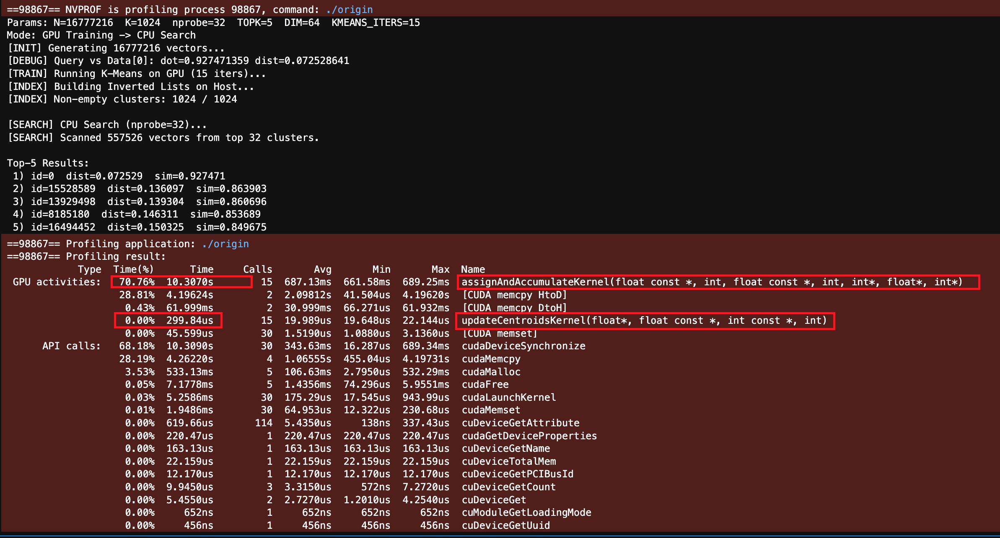

# 🚀 CUDA-Accelerated K-Means : Foundation for Scalable ANN Search

This project focuses on delivering a highly optimized, GPU-accelerated implementation of the K-Means Clustering algorithm. This acceleration is critical because K-Means serves as the foundational infrastructure for nearly all scalable **Approximate Nearest Neighbor (ANN) search** systems.

The core objective is to minimize the time required to partition massive, high-dimensional vector datasets, thereby enabling rapid construction of the search structure.

---
## What is K-MEAN and why it s related to Machine Learning ?

K-Means is an algorithm used to partition $N$ data points into $K$ pre-defined, non-overlapping clusters (or groups).

1. Goal: To minimize the Within-Cluster Sum of the total distance between each data point and the center (centroid) of the cluster it belongs to.
2. Result: Data points within the same cluster are highly similar, while points in different clusters are dissimilar.
3. Inputs:The Dataset (a collection of high-dimensional vectors).The value of $K$ (the desired number of clusters).

It is one of the most fundamental and widely used Unsupervised Machine Learning algorithms. It is essential for partitioning large, high-dimensional datasets into distinct, coherent groups.In modern AI pipelines, this acts as the high-performance 'Retrieval Engine' for Vector Embeddings generated by Deep Learning models (such as BERT for text or ResNet for images). It is the core technology behind semantic search, recommendation systems, and the long-term memory (RAG) used by Large Language Models (LLMs)."


## How K-means trained in C++ code ?

---

## A simple Case to describe demo


Imagine you are a logistics giant (like Amazon) operating in a massive city with 16 million customers ($N$). Your goal is to build 1,024 delivery stations ($K$) to ensure every customer gets the fastest service possible.

* **Phase 1: K-Means Training (Building the Network)**

 *  Day 1: Blind Selection (Initialization)You don't know where the customers live yet, so you randomly drop 1,024 temporary kiosks on the map. Some land in lakes; some land in empty fields. It is inefficient.

 *  The "Assignment" Morning (Assignment-Step)Every single one of the 16 million customers checks their GPS to find which of the 1,024 kiosks is closest to their home. They register themselves: "I belong to Station #5."(In Code: The GPU calculates 16M $\times$ 1024 distances in parallel.)

 * The "Relocation" Evening (Relocation-Step)The manager of Station #5 looks at his list and realizes: "All my customers live 3 miles north, but I'm stuck here in the south."He calculates the exact geographic center (average coordinate) of all his registered customers and moves the station there overnight to be closer to everyone.

 * Iteration (Convergence)Because the stations moved, some customers realize a different station is now closer. They switch registrations. The stations move again to adjust. After 15 days (iterations), the stations stop moving. They are now perfectly positioned in the center of the 1,024 most dense population hubs.

* **Phase 2: IVF Search (Delivering the Package)**

Now a new order comes in (The Query Vector $q$). 

We need to find which existing customer is most similar to this new order (Nearest Neighbor).

* The Old Way (Brute Force)You send a driver to knock on all 16 million doors in the city to see who placed the order.Result: It takes 4 seconds. The pizza is cold. The customer is angry.

* The New Way (IVF Search)Step A: Coarse Search (Find the District)Instead of looking at houses, you only look at the 1,024 Delivery Stations. You calculate: "Which station is closest to this new order address?"You find that Station #5 (and maybe its neighbors, Station #6 and #7) is the closest.Step B: Fine Search (Last Mile)You open the list for Station #5. It only serves 15,000 customers. You only check these specific houses.Result: You found the target in 15 milliseconds. The pizza is stillhot.


### Why K-Mean training could be accerlated by using Cuda?
The core task—calculating distances for millions of vectors—is "embarrassingly parallel." Since every vector can be processed independently, we can launch millions of threads to instantly saturate the GPU's thousands of cores, achieving a speedup that CPUs simply cannot match.

---


# Main focus: Parallelism & Efficiency

The key shows in maximizing parallelism and efficiency across the two main K-Means steps:

| Component | Description | **Acceleration & Optimization** | function 
| :--- | :--- | :--- | :---|
| **Massive Parallel steps (Assignment)** | Utilizing the GPU's SIMT (Single Instruction, Multiple Threads) architecture, each of the $N$ data points is assigned a dedicated thread to calculate its distance to all $K$ centroids independently. | Compute-Bound Optimization: This transforms the heavy $O(N \times K)$ matrix operation into a massively parallel workload. It fully saturates the GPU's CUDA cores and hides memory latency through high arithmetic intensity. | **assignAndAccumulateKernel**|
| **GPU-Optimized M-step (Relocation)** | Uses thread-safe **`atomicAdd`** operations to efficiently accumulate the vector sums and counts for each of the $K$ partitions (clusters). | Minimizes synchronization and reduces the overall training time. | **updateCentroidsKernel**|


```c++
__global__ void assignAndAccumulateKernel(const float* data,int N,const float* centroids,int K,int* assign,float* sums,int* counts) {
    for (int i = blockIdx.x * blockDim.x + threadIdx.x;
         i < N;
         i += gridDim.x * blockDim.x) {

        const float* xi = data + (size_t)i * DIM;

        int bestC = 0;
        float bestD = 1e30f;

        for (int c = 0; c < K; ++c) {
            const float* ctr = centroids + (size_t)c * DIM;
            float dot = 0.f;
            for (int d = 0; d < DIM; ++d) {
                dot += xi[d] * ctr[d];
            }
            float dist = 1.f - dot;
            if (dist < bestD) {
                bestD = dist;
                bestC = c;
            }
        }

        assign[i] = bestC;
        atomicAdd(&counts[bestC], 1);
        size_t base = (size_t)bestC * DIM;
        for (int d = 0; d < DIM; ++d) {
            atomicAdd(&sums[base + d], xi[d]);
        }
    }
}


// Update centroids
__global__ void updateCentroidsKernel(float* centroids,const float* sums,const int* counts,int K) {
    int c = blockIdx.x * blockDim.x + threadIdx.x;
    if (c >= K) return;

    int cnt = counts[c];
    float* ctr = centroids + (size_t)c * DIM;
    const float* sumc = sums + (size_t)c * DIM;

    if (cnt > 0) {
        double norm2 = 0.0;
        for (int d = 0; d < DIM; ++d) {
            float v = sumc[d] / (float)cnt;
            ctr[d] = v;
            norm2 += (double)v * (double)v;
        }
        float n = float(std::sqrt(norm2) + 1e-12);
        for (int d = 0; d < DIM; ++d) {
            ctr[d] /= n;
        }
    }
}

```


### Parameters

These define the scale and quality of the partitioning infrastructure:

| Parameter | Macro | Description | Default Value |
| :--- | :--- | :--- | :--- |
| **Total Data Points** | `N` | The size of the vector dataset to be partitioned. | $2^{24} \approx 16$ Million |
| **Number of Clusters** | `K` | The final number of partitions (centroids) generated for the ANN search structure. | 1024 |
| **K-Means Iterations** | `KMEANS_ITERS` | The number of training cycles required to stabilize the $K$ partitions. | 15 |

---

## Verification: Validating Acceleration on ANN Search

To validate the efficiency and quality of the accelerated K-Means output, we perform a subsequent ANN Search Verification step.

after The process of training, code will generates $K$ highly optimized centroids and assigns $N$ data points to one of these $K$ partitions.And Convert them into $K$ number of IVFs (Inverted File Index)| This output is the last critical stage for building the ANN search structure

```c++

static void buildInvertedLists(
    const std::vector<int>& assign,
    int N, int K,
    std::vector<std::vector<int>>& lists
) {
    lists.assign(K, {});
    for (int i = 0; i < N; ++i) {
        int c = assign[i];
        if (c >= 0 && c < K) {
            lists[c].push_back(i);
        }
    }
}
```

### The core goal 

this step is to accurately identify the $TOPK$ nearest neighbors to a query vector $Q$ among the entire massive dataset of $N$ vectors.
And compare how speedup we achieved by using **CUDA** acclerration comparing sequential process via **C++**

* This is accomplished by leveraging the trained partitions: first, the query $Q$ is compared against the $K$ centroids for a Coarse Search to select the closest $N_{PROBE}$ partitions; second, all vectors from these selected partitions are collected into a Candidate Set; and finally, an optimized Top-K Final Search is executed solely on this small candidate set to pinpoint and return the $TOPK$ results. The successful and rapid execution of this entire sequence confirms that the K-Means acceleration was effective in building a high-quality, scalable foundation for search retrieval.

---

## Environment and Execution

* **Jupyter Server:** :CUDA Version: 12.9   
* **Software:** NVIDIA CUDA Toolkit (v11.x+), `nvcc` compiler.
* **gcc:** Version c++ 17

### Compilation and Running

```bash
# Compile: Focused on K-Means and the ANN infrastructure build
nvcc -O3 -std=c++17 -arch=sm_70 origin.cu -o origin -Wno-deprecated-gpu-targets

# Run: Executes the accelerated clustering process and the ANN verification search
./ann_kmeans_accelerated
```

---


## Performance execution

### CUDA version



### C++ version


### SpeedUp Comparison

| n            |     C++ (ms) |   CUDA (ms) | SpeedUp (sequential VS parallel) |
| ------------ | ---------: | ---------: | ---------: | 
| 2^8          | |||
| 2^10 (1024)  |   |    |     |
| 2^14         | | | |
| 2^20 (8192)  |   |  |    |
| 2^24 (16.7M) |  |  |  |

---

## Simulation Explain

To test the scalability and performance of the accelerated K-Means implementation, the project generates and use a large, synthetic dataset that simulates structured, high-dimensional vector embeddings.

* **Dimensionality:** Vectors are set to $DIM=64$.
* **Base Components:** The embedding generation relies on two sets of randomly generated unit vectors:
    * **`numberBase` (75 vectors):** Represents the feature vectors for the "card numbers" (1 to 75).
    * **`posBase` (25 vectors):** Represents the feature vectors for the "card positions" (0 to 24).

### Rationale for the $5 \times 5$ Structure

The selection of **25 positions** (simulating a $5 \times 5$ card/grid) for generating the data vectors is a deliberate choice to facilitate demonstration and concept verification. This structure is intended to **mimic the spatial organization** found in various real-world scenarios:

* **Image Processing:** A $5 \times 5$ grid is similar to the arrangement of **pixels** or local **feature patches** in an image.
* **Sequential/Structured Data:** The grid represents structured data where both the element's **value** (the card number) and its **location** (the position index) contribute to the overall embedding.

This simulation ensures the dataset exhibits the characteristics of real-world structured embeddings, allowing for a meaningful test of the K-Means accelerator's performance.

### how we compute vector embedding value ?

In project, each final $DIM=64$ data vector $V$ is computed based on a **linear combination** of base vectors derived from 25 "card slots" This models how features (card number) and positional context (slot index) contribute to the final embedding.

The computation for a single vector $V$ is defined by the following process, executed for all $D=0$ to $63$ dimensions:

1.  **Initialization:** The final vector $V$ is initialized to zero in all dimensions: $V_d = 0$.
2.  **Iterative Contribution:** The process iterates over all $I=0$ to $24$ card slots. In each slot $I$, the card number $N_I$ (ranging 1 to 75) contributes to the final vector $V$.
3.  **Combination Formula:** For each dimension $d$, the contribution is calculated by summing the components of the base vectors:

$$V_d = \sum_{I=0}^{24} \left( (\text{numberBase}[N_I])_d + \alpha \cdot (\text{posBase}[I])_d \right)$$

* **$\text{numberBase}[N_I]$:** The base vector associated with the card number $N_I$.
* **$\text{posBase}[I]$:** The base vector associated with the slot position $I$.
* **$\alpha$ (ALPHA):** A weighting factor (set to $0.7$) that controls the influence of the positional context relative to the feature value.

```C++
static Vec cardToVec(const int card[25]) {
    Vec out(DIM, 0.f);
    for (int i = 0; i < 25; i++) {
        int n = card[i];
        if (n < 1 || n > 75) {
            fprintf(stderr, "number out of range\n");
            exit(1);
        }
        const Vec &b = numberBase[n];
        const Vec &p = posBase[i];
        for (int j = 0; j < DIM; j++)
            out[j] += b[j] + ALPHA * p[j];
    }
    normInPlace(out);
    return out;
}
```

---


## Future Optimization Strategy

While the heavy reliance on **atomicAdd** creates a performance bottleneck, this initial version is designed to be the most faithful implementation of the standard ANN K-Means logic. Consequently, future performance optimizations should prioritize mitigating the contention caused by these atomic operations


---


## Reference

