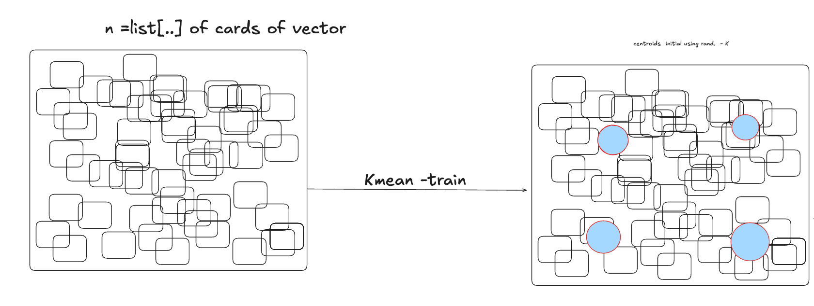
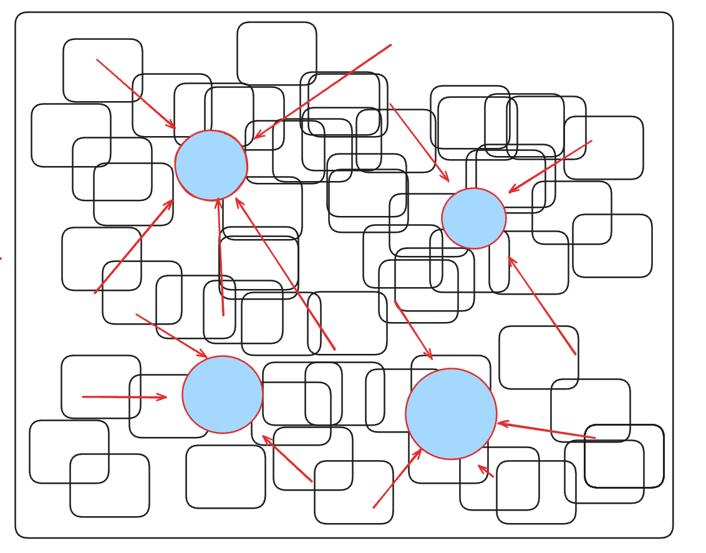

# 🚀 CUDA-Accelerated K-Means : Foundation for Scalable ANN Search

This project focuses on delivering a highly optimized, GPU-accelerated implementation of the K-Means Clustering algorithm. This acceleration is critical because K-Means serves as the foundational infrastructure for nearly all scalable **Approximate Nearest Neighbor (ANN) search** systems.

The core objective is to minimize the time required to partition massive, high-dimensional vector datasets, thereby enabling rapid construction of the search structure.

---
## What is K-MEAN and why it s related to Machine Learning ?

K-Means is one of the most fundamental and widely used Unsupervised Machine Learning algorithms. It is essential for partitioning large, high-dimensional datasets into distinct, coherent groups.

K-Means is an algorithm used to partition $N$ data points into $K$ pre-defined, non-overlapping clusters (or groups).

1. Goal: To minimize the Within-Cluster Sum of the total distance between each data point and the center (centroid) of the cluster it belongs to.
2. Result: Data points within the same cluster are highly similar, while points in different clusters are dissimilar.
3. Inputs:The Dataset (a collection of high-dimensional vectors).The value of $K$ (the desired number of clusters).



---

## How K-means trained in C++ code ?


## Main focus : How we use cuda to accelerate K-Means Training

The key shows in maximizing parallelism and efficiency across the two main K-Means steps:

| Component | Description | **Acceleration & Optimization** |
| :--- | :--- | :--- |
| **Parallel E-step (Assignment)** | Every data point concurrently calculates its distance to all $K$ centroids. | Achieves massive, parallel throughput over the entire dataset $N$. |
| GPU-Optimized M-step (Update) | Uses thread-safe **`atomicAdd`** operations to efficiently accumulate the vector sums and counts for each of the $K$ partitions (clusters). | Minimizes synchronization and reduces the overall training time. |
| **Partitioning Output** | The process generates $K$ highly optimized centroids and assigns $N$ data points to one of these $K$ partitions. | This output is the critical first stage for building the ANN search structure. |




### Parameters

These define the scale and quality of the partitioning infrastructure:

| Parameter | Macro | Description | Default Value |
| :--- | :--- | :--- | :--- |
| **Total Data Points** | `N` | The size of the vector dataset to be partitioned. | $2^{20} \approx 1$ Million |
| **Number of Clusters** | `K` | The final number of partitions (centroids) generated for the ANN search structure. | 1024 |
| **K-Means Iterations** | `KMEANS_ITERS` | The number of training cycles required to stabilize the $K$ partitions. | 15 |

---

## Data Simulation

To test the scalability and performance of the accelerated K-Means implementation, the project generates and use a large, synthetic dataset that simulates structured, high-dimensional vector embeddings.

* **Dimensionality:** Vectors are set to $DIM=64$.
* **Base Components:** The embedding generation relies on two sets of randomly generated unit vectors:
    * **`numberBase` (75 vectors):** Represents the feature vectors for the "card numbers" (1 to 75).
    * **`posBase` (25 vectors):** Represents the feature vectors for the "card positions" (0 to 24).

### Rationale for the $5 \times 5$ Structure

The selection of **25 positions** (simulating a $5 \times 5$ card/grid) for generating the data vectors is a deliberate choice to facilitate demonstration and concept verification. This structure is intended to **mimic the spatial organization** found in various real-world scenarios:

* **Image Processing:** A $5 \times 5$ grid is similar to the arrangement of **pixels** or local **feature patches** in an image.
* **Sequential/Structured Data:** The grid represents structured data where both the element's **value** (the card number) and its **location** (the position index) contribute to the overall embedding.

This simulation ensures the dataset exhibits the characteristics of real-world structured embeddings, allowing for a meaningful test of the K-Means accelerator's performance.

### how we compute vector embedding value ?

In project, each final $DIM=64$ data vector $V$ is computed based on a **linear combination** of base vectors derived from 25 "card slots" This models how features (card number) and positional context (slot index) contribute to the final embedding.

The computation for a single vector $V$ is defined by the following process, executed for all $D=0$ to $63$ dimensions:

1.  **Initialization:** The final vector $V$ is initialized to zero in all dimensions: $V_d = 0$.
2.  **Iterative Contribution:** The process iterates over all $I=0$ to $24$ card slots. In each slot $I$, the card number $N_I$ (ranging 1 to 75) contributes to the final vector $V$.
3.  **Combination Formula:** For each dimension $d$, the contribution is calculated by summing the components of the base vectors:

$$V_d = \sum_{I=0}^{24} \left( (\text{numberBase}[N_I])_d + \alpha \cdot (\text{posBase}[I])_d \right)$$

* **$\text{numberBase}[N_I]$:** The base vector associated with the card number $N_I$.
* **$\text{posBase}[I]$:** The base vector associated with the slot position $I$.
* **$\alpha$ (ALPHA):** A weighting factor (set to $0.7$) that controls the influence of the positional context relative to the feature value.

```C++
static Vec cardToVec(const int card[25]) {
    Vec out(DIM, 0.f);
    for (int i = 0; i < 25; i++) {
        int n = card[i];
        if (n < 1 || n > 75) {
            fprintf(stderr, "number out of range\n");
            exit(1);
        }
        const Vec &b = numberBase[n];
        const Vec &p = posBase[i];
        for (int j = 0; j < DIM; j++)
            out[j] += b[j] + ALPHA * p[j];
    }
    normInPlace(out);
    return out;
}
```

---

## Verification: Validating Acceleration on ANN Search

To validate the efficiency and quality of the accelerated K-Means output, we perform a subsequent ANN Search Verification step.

### The core goal 

this step is to accurately identify the $TOPK$ nearest neighbors to a query vector $Q$ among the entire massive dataset of $N$ vectors.
And compare how speedup we achieved by using **CUDA** acclerration comparing sequential process via **C++**

* This is accomplished by leveraging the trained partitions: first, the query $Q$ is compared against the $K$ centroids for a Coarse Search to select the closest $N_{PROBE}$ partitions; second, all vectors from these selected partitions are collected into a Candidate Set; and finally, an optimized Top-K Final Search is executed solely on this small candidate set to pinpoint and return the $TOPK$ results. The successful and rapid execution of this entire sequence confirms that the K-Means acceleration was effective in building a high-quality, scalable foundation for ANN retrieval.

---

## Environment and Execution

* **Jupyter Server:** :CUDA Version: 12.9   
* **Software:** NVIDIA CUDA Toolkit (v11.x+), `nvcc` compiler.
* **gcc:** Version 

### Compilation and Running

```bash
# Compile: Focused on K-Means and the ANN infrastructure build
nvcc kmean_cuda.cu -o kmean_cuda -O3 -arch=sm_70 -std=c++14

# Run: Executes the accelerated clustering process and the ANN verification search
./ann_kmeans_accelerated
```

---


## Performance execution


### CUDA version


### C++ version


### SpeedUp Comparison


### Reference